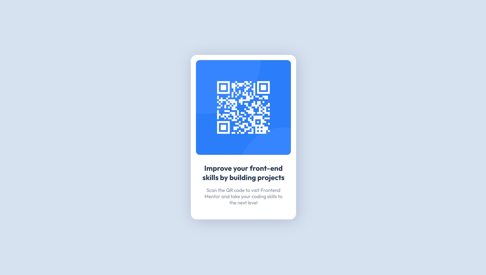

# Frontend Mentor - QR code component solution

My Solution to the [QR code component challenge on Frontend Mentor](https://www.frontendmentor.io/challenges/qr-code-component-iux_sIO_H)

### Screenshot

### Links

- [GitHub](https://github.com/MorganGray28/QR-code-component-frontendmentor)
- [Live Site](https://qr-code-component-frontendmentor-two.vercel.app/)

### Built with

- Semantic HTML5 markup
- CSS custom properties
- Flexbox
- React
